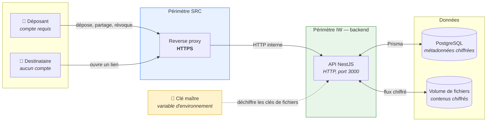
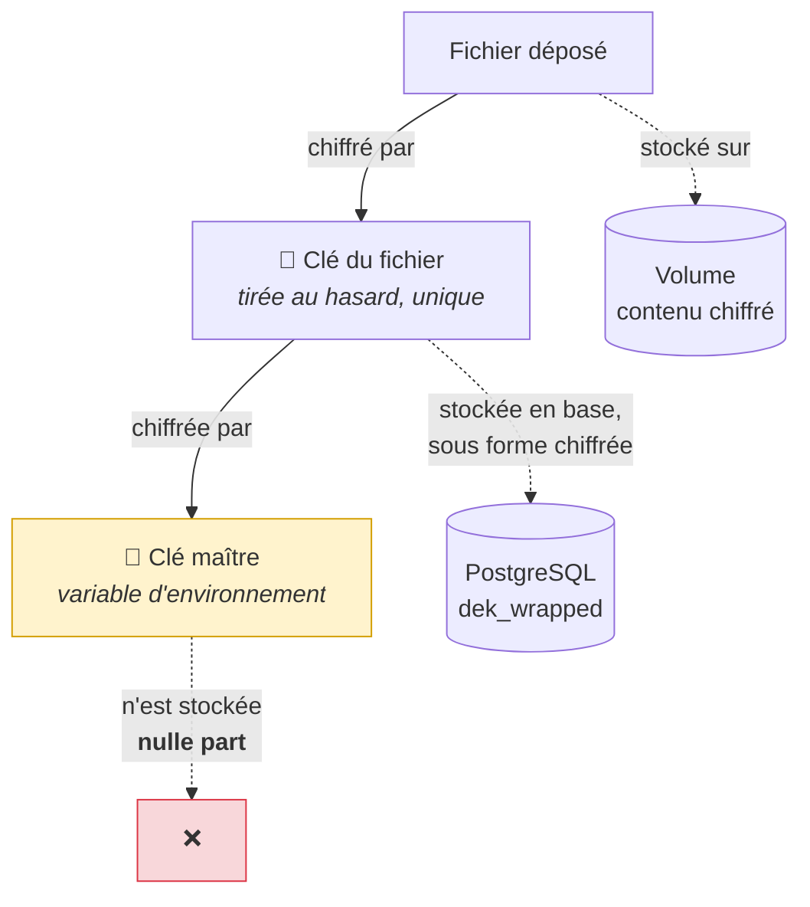
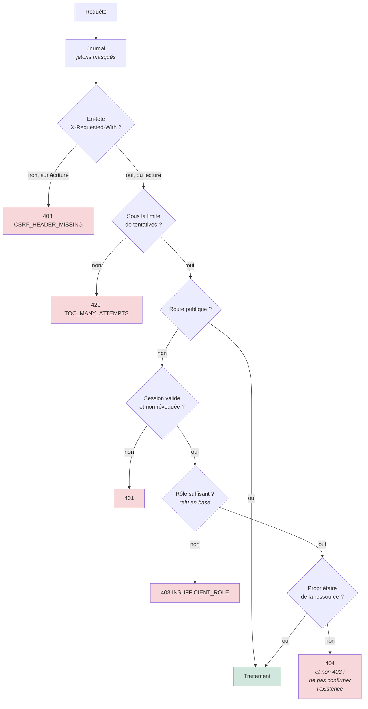
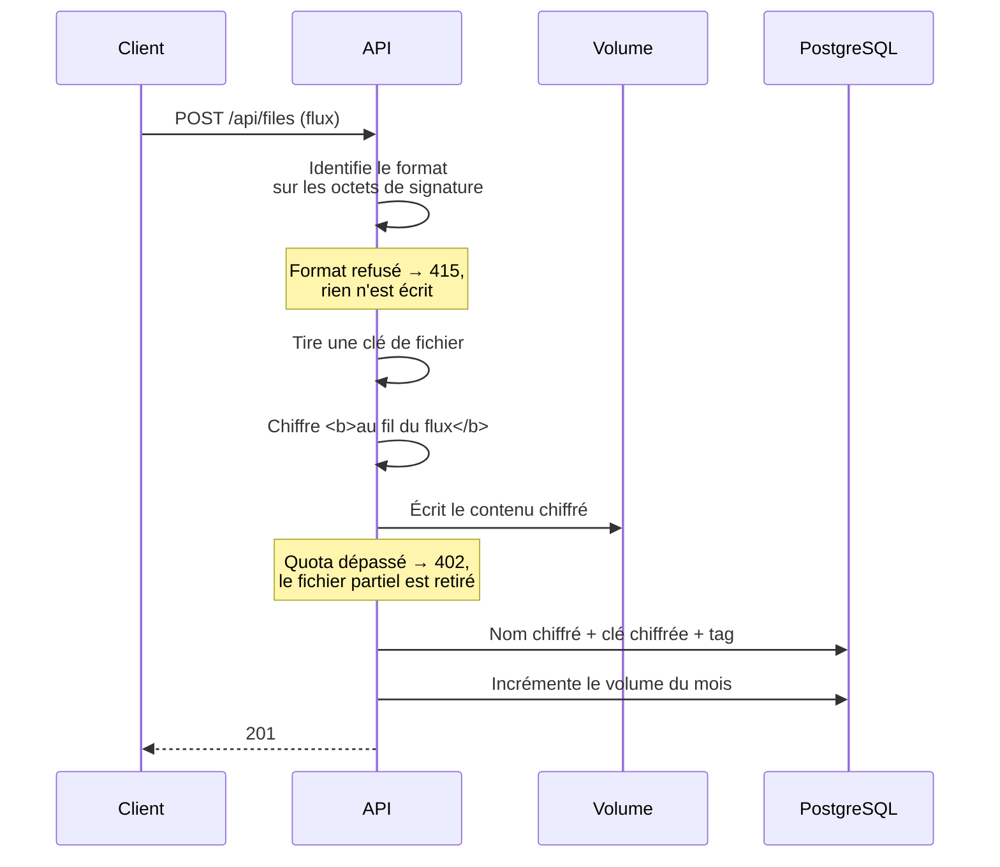
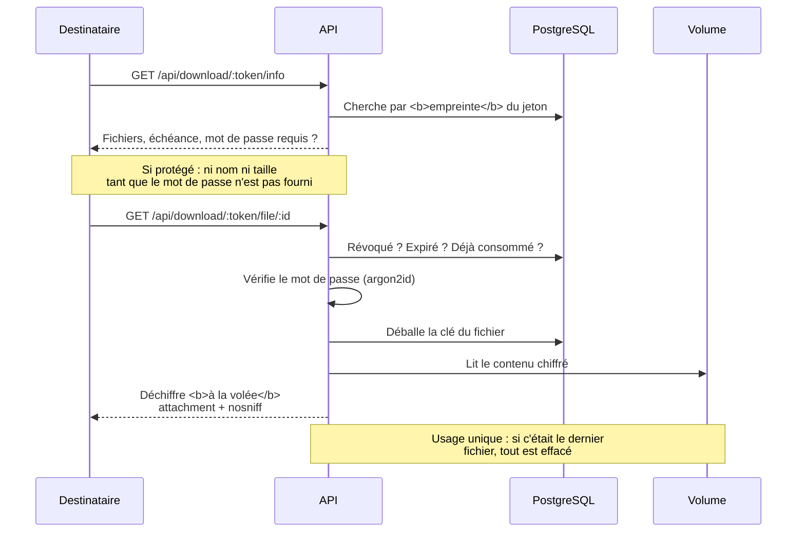
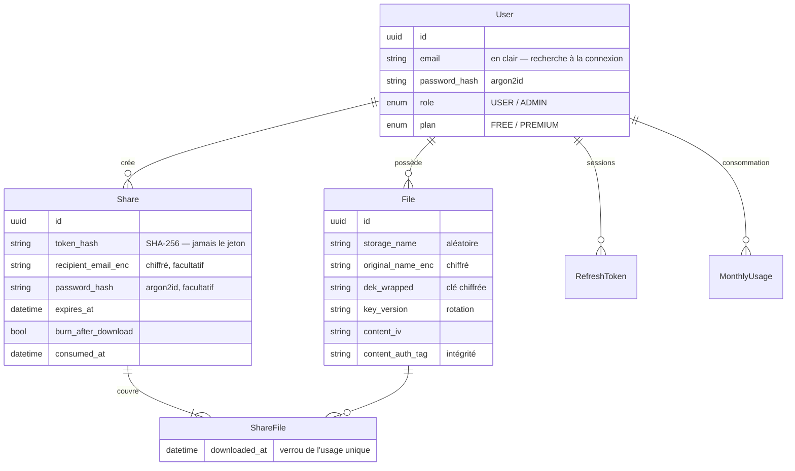
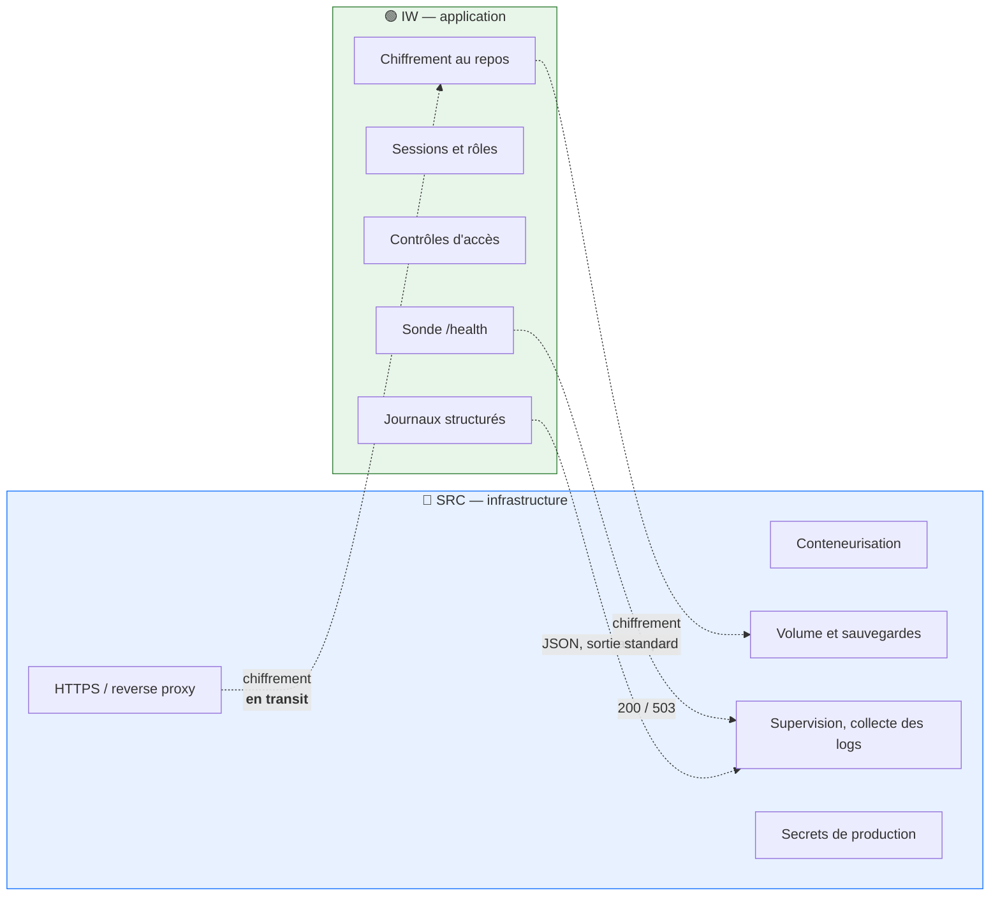

# Architecture — partie backend

Ma part du schéma commun. Les diagrammes sont en Mermaid : ils se rendent
directement sur GitHub et restent modifiables, contrairement à une image.

---

## 1. Composants et échanges

**Ce que le schéma doit faire comprendre :** la clé maître n'est **ni en base ni
sur le volume**. Voler l'un des deux — ou les deux — ne suffit pas.

---

## 2. Le chiffrement enveloppe

**Pourquoi ce détour plutôt qu'une clé unique :** changer la clé maître ne
demande de réécrire que les clés de fichiers — quelques dizaines d'octets
chacune. Les fichiers ne sont jamais relus. *Mesuré : 101 ms pour tout le
service, contre plusieurs heures s'il fallait tout re-chiffrer.*

---

## 3. Les contrôles d'accès, dans l'ordre

**Le rôle est relu en base à chaque appel**, pas porté par le jeton : un retrait
de privilège prend effet immédiatement, au lieu d'attendre l'expiration de la
session.

---

## 4. Dépôt d'un fichier

**Le contenu n'existe en clair à aucun moment sur le serveur** — ni sur le
disque, ni en mémoire complète. Les deux modes de réception fournis par la
bibliothèque standard ont été écartés pour cette raison.

---

## 5. Téléchargement par un destinataire sans compte

---

## 6. Modèle de données

**Ce qui est en clair, et pourquoi :** seul `users.email` — la connexion doit
pouvoir chercher par email. La donnée sensible d'un partage, c'est l'email du
*destinataire*, et celui-là est chiffré.

---

## 7. Répartition des responsabilités

**La décision commune structurante :** l'infrastructure protège les données **en
transit**, le backend les protège **au repos**. Ni l'un ni l'autre ne couvre les
deux, et aucun des deux n'est suffisant seul.

---

## Limites assumées

- **Une seule instance.** Le stockage est un volume attaché à une machine : pas
  de répartition de charge ni de bascule automatique.
- **Perte de la machine = perte des fichiers** depuis la dernière sauvegarde.
- **Le serveur détient les clés.** Ce n'est pas du chiffrement de bout en bout :
  un administrateur système y a techniquement accès. L'API, elle, n'offre aucun
  chemin vers le contenu — y compris aux administrateurs du service.
- **Indisponibilité de quelques secondes** au redémarrage.
