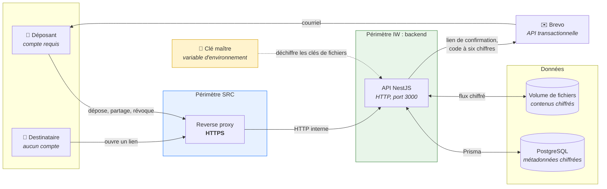
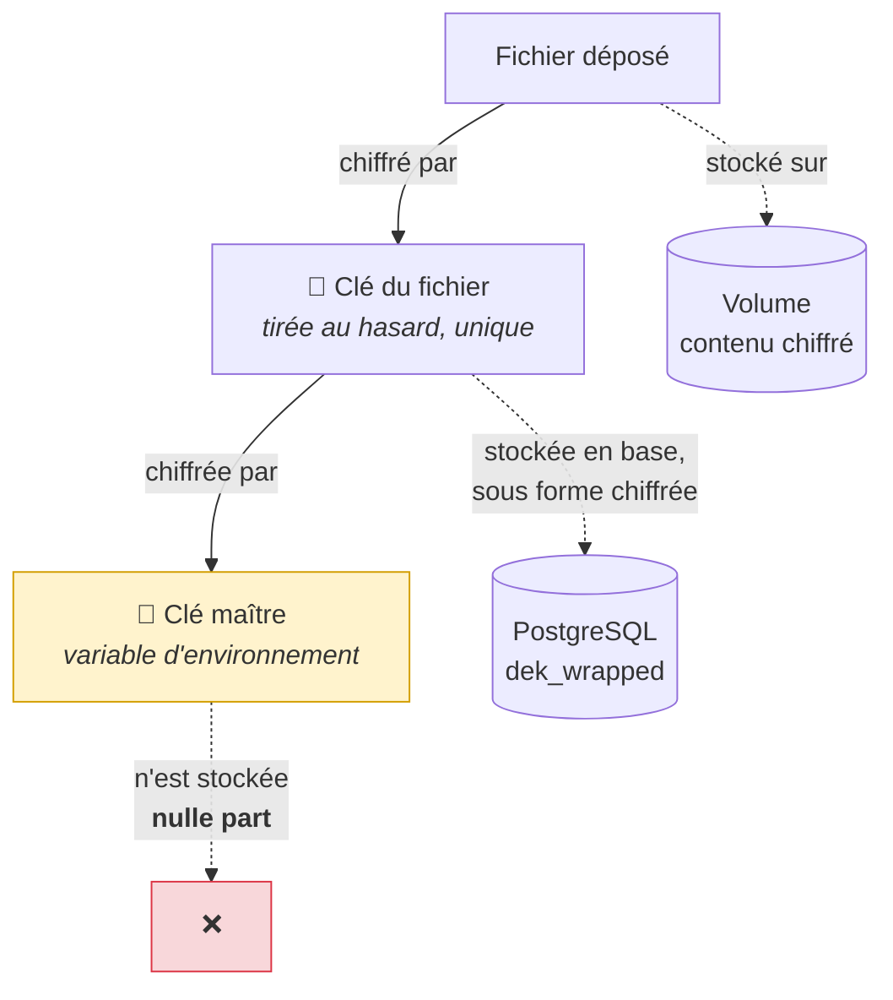
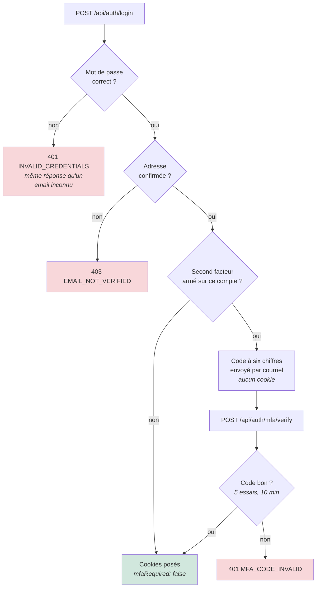
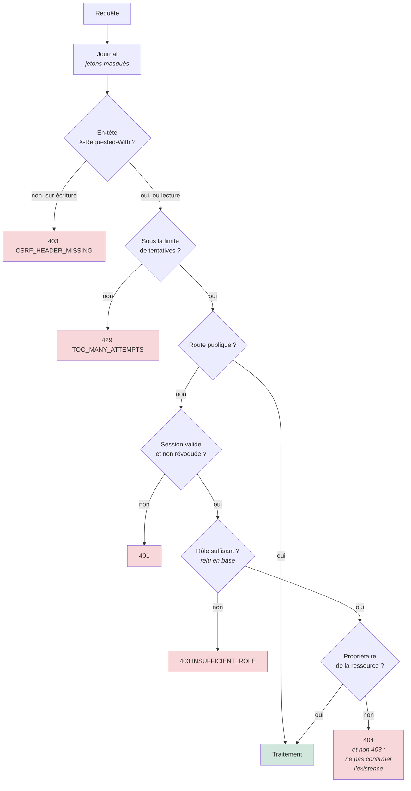
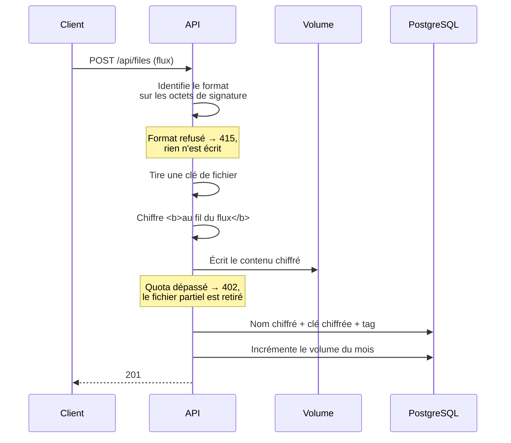
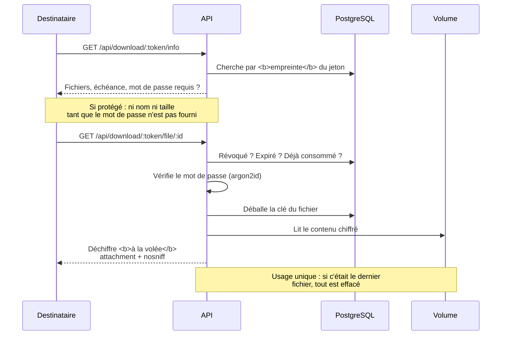
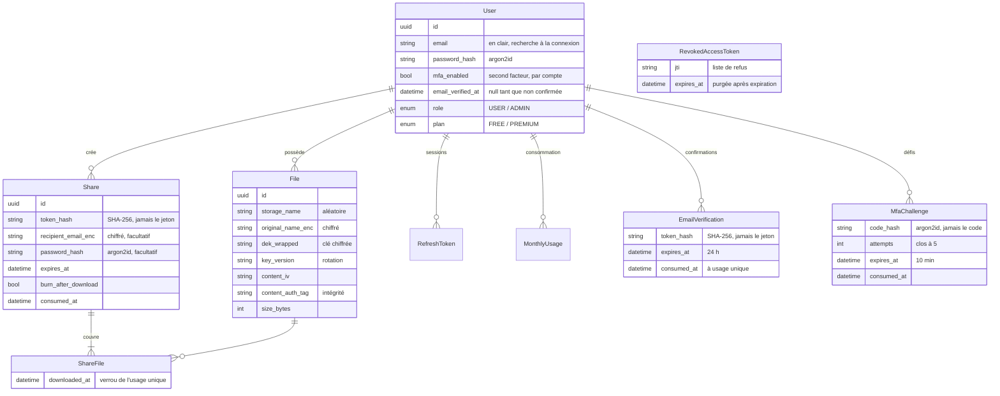
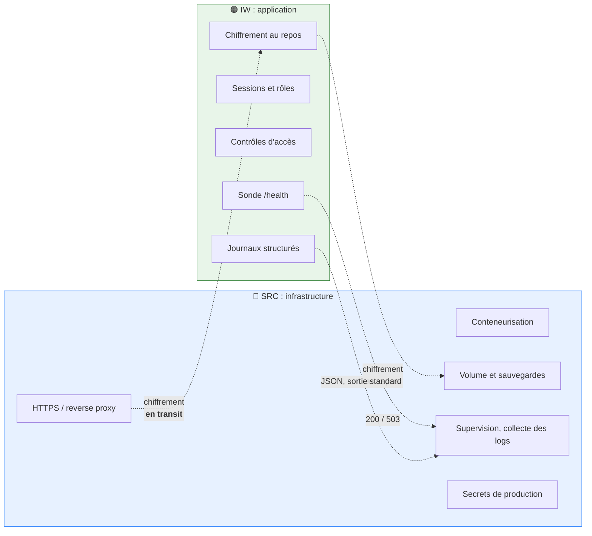

# Architecture : partie backend

Les diagrammes sont en Mermaid

---

## 1. Composants et échanges

**Ce que le schéma doit faire comprendre :** la clé maître n'est **ni en base ni
sur le volume**. Voler l'un des deux, ou les deux, ne suffit pas.

Brevo est la seule dépendance externe. Elle n'est sollicitée qu'à l'inscription
et à la connexion des comptes ayant armé le second facteur : une panne de ce
service n'empêche ni le dépôt, ni le partage, ni le téléchargement.

---

## 2. Le chiffrement enveloppe

**Pourquoi ce détour plutôt qu'une clé unique :** changer la clé maître ne
demande de réécrire que les clés de fichiers, quelques dizaines d'octets
chacune. Les fichiers ne sont jamais relus. *Mesuré : 101 ms pour tout le
service, contre plusieurs heures s'il fallait tout re-chiffrer.*

---

## 3. Ouverture d'une session

**La confirmation d'adresse est contrôlée après le mot de passe**, jamais avant.
Répondre « adresse non confirmée » à qui n'a pas les identifiants transformerait
la connexion en oracle révélant quels comptes existent.

**Le second facteur est un réglage par compte**, désactivé par défaut et
basculé depuis la page de profil. L'imposer à tous ferait dépendre chaque
connexion d'un envoi de courriel qui aboutit. Sa bascule exige le mot de passe :
une session volée ne doit pas suffire à désarmer la protection qui rend
justement le vol difficile.

---

## 4. Les contrôles d'accès, dans l'ordre

**Le rôle est relu en base à chaque appel**, pas porté par le jeton : un retrait
de privilège prend effet immédiatement, au lieu d'attendre l'expiration de la
session.

---

## 5. Dépôt d'un fichier

**Le contenu n'existe en clair à aucun moment sur le serveur**, ni sur le
disque, ni en mémoire complète. Les deux modes de réception fournis par la
bibliothèque standard ont été écartés pour cette raison.

---

## 6. Téléchargement par un destinataire sans compte

---

## 7. Modèle de données

**Ce qui est en clair, et pourquoi :** seul `users.email`, parce que la connexion doit
pouvoir chercher par email. La donnée sensible d'un partage, c'est l'email du
*destinataire*, et celui-là est chiffré.

---

## 8. Répartition des responsabilités

**La décision commune structurante :** l'infrastructure protège les données **en
transit**, le backend les protège **au repos**. Ni l'un ni l'autre ne couvre les
deux, et aucun des deux n'est suffisant seul.

---

## Limites assumées

- **Une seule instance.** Le stockage est un volume attaché à une machine : pas
  de répartition de charge ni de bascule automatique.
- **Perte de la machine = perte des fichiers** depuis la dernière sauvegarde.
- **Le serveur détient les clés.** Ce n'est pas du chiffrement de bout en bout :
  un administrateur système y a techniquement accès. L'API, elle, n'offre aucun
  chemin vers le contenu, y compris aux administrateurs du service.
- **Indisponibilité de quelques secondes** au redémarrage.
- **Dépendance à un service tiers pour les courriels.** Sans Brevo joignable,
  aucune inscription ne peut aboutir et les comptes ayant armé le second facteur
  ne peuvent plus se connecter. Le reste du service continue de fonctionner.

---

## Conservation des fichiers

Un fichier n'est pas effacé à l'expiration de son lien, mais **N jours après la
fin de son dernier partage** : 30 jours pour l'offre gratuite, 90 pour l'offre
payante. Un fichier partagé pour 30 jours survit donc à son lien, et le délai ne
commence à courir qu'ensuite.

Deux exceptions l'effacent plus tôt : la suppression par son propriétaire, et la
consommation d'un lien à usage unique.

La purge est une tâche planifiée (`npm run files:purge`), pas un effet de bord
d'une requête : elle est déclenchée par l'infrastructure, journalisée, et son
échec est visible. Voir [configuration-deploiement.md](configuration-deploiement.md).
