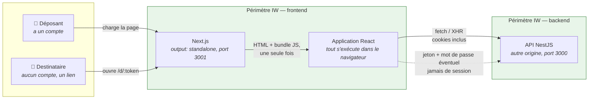
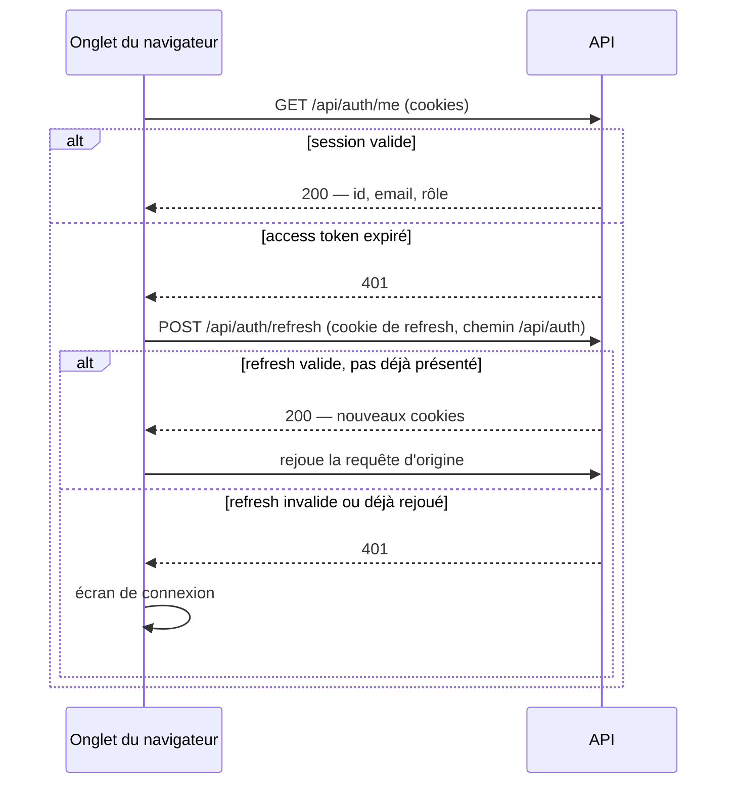
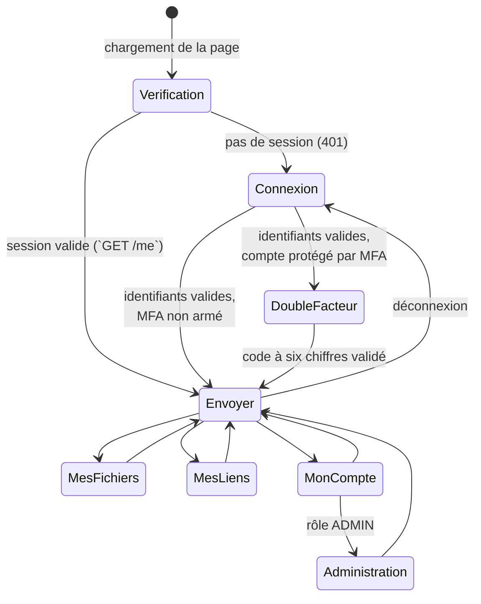
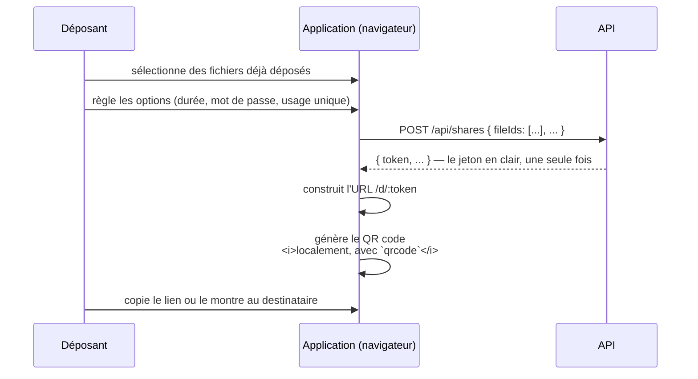
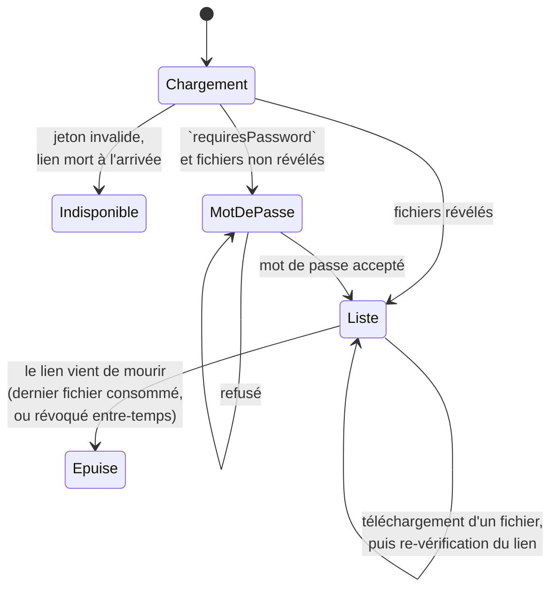
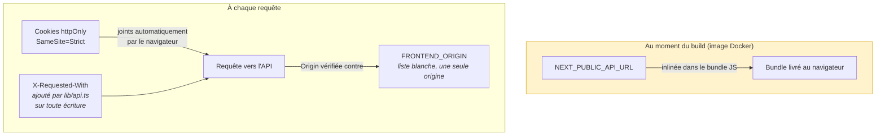

# Architecture — partie frontend

Ma part du schéma commun, à lire avec [architecture-backend.md](architecture-backend.md).
Les diagrammes sont en Mermaid : ils se rendent directement sur GitHub et
restent modifiables, contrairement à une image.

---

## 1. Composants et échanges

**Ce que le schéma doit faire comprendre :** Next.js ne fait **que servir la
page**. Une fois le bundle chargé, le serveur frontend sort du jeu — toute la
donnée circule ensuite en direct entre le navigateur et l'API, sur une origine
différente. Il n'y a ni Server Actions, ni route API Next, ni
« Backend-For-Frontend » : `frontend/lib/api.ts` est le seul point de passage
vers le backend, et il parle depuis le navigateur, pas depuis le serveur
Next.js.

**Conséquence directe :** l'application ne pourrait pas fonctionner derrière
un pare-feu qui laisserait passer le frontend mais pas l'API — les deux
doivent être joignables **depuis le poste du visiteur**.

---

## 2. Le renouvellement de session, en silence

**Aucun jeton ne transite par `localStorage` ni par une variable JavaScript** :
les deux cookies posés par le backend sont `httpOnly`, donc invisibles au code
de la page. `lib/api.ts` ne fait qu'ajouter `credentials: "include"` à chaque
appel — le navigateur se charge du reste.

**Le rafraîchissement est transparent pour le reste de l'application.** La
fonction `request()` intercepte elle-même un premier `401`, tente
`/api/auth/refresh`, puis rejoue l'appel d'origine une seule fois
(`skipRefresh`). Aucun composant n'a besoin de savoir qu'une session a expiré
en cours de route.

**Un seul rafraîchissement à la fois.** Si plusieurs requêtes échouent en même
temps (la page charge le quota, les fichiers et les liens en parallèle), elles
partageraient sinon trois tentatives de rafraîchissement concurrentes contre
un jeton de refresh **à usage unique** côté backend — la deuxième serait vue
comme un rejeu et couperait la session (voir la détection de rejeu,
[architecture-backend.md](architecture-backend.md)). `refreshInFlight`
mutualise l'appel : une seule tentative part, les autres attendent son
résultat.

---

## 3. Les écrans, comme une machine à états

**Un seul composant, un seul `screen`.** `FileTransferApp` porte tout l'état de
l'application ; changer d'onglet ne démonte ni ne remonte rien, il change
simplement ce qui est affiché. Sans bibliothèque de routage ni de gestion
d'état — un choix tenable parce que l'application entière tient dans cinq
écrans.

**Aucun cache : chaque entrée d'onglet redemande au serveur.** `goToScreen`
relance `refreshFiles`, `refreshShares` ou `refreshAdmin` selon la
destination, plutôt que de réutiliser ce qui a déjà été chargé. C'est le
correctif direct des défauts trouvés en manipulant l'interface (journal de
sprint, §5) : un fichier supprimé par un lien à usage unique, ou un lien
consommé, n'ont aucun moyen de prévenir la page qui les affiche — il faut
redemander.

**L'onglet « Administration » n'est qu'un affichage conditionnel** :
`isRoleAdmin = user?.role === "ADMIN"` décide seulement si le lien apparaît
dans la navigation. Il ne protège rien — chaque appel `api.admin*` est revérifié
côté serveur, rôle relu en base à chaque requête, jamais porté par le jeton
(voir architecture-backend.md, §3). Masquer l'onglet est un confort d'affichage
pour un compte qui n'y a pas accès, pas un contrôle d'accès.

---

## 4. Créer et distribuer un lien de partage

**Le jeton n'est reçu qu'une fois.** `Share` (tel que renvoyé par
`GET /api/shares`, la liste des liens créés) ne porte pas de champ `token` —
seul `CreatedShare`, la réponse immédiate de la création, l'a. Recharger la
liste des liens ne permet donc jamais de faire réafficher une URL déjà créée ;
c'est une propriété du backend (il ne garde que l'empreinte), pas une omission
du frontend.

**Le QR code ne quitte jamais le navigateur.** `qrcode` dessine sur un
`<canvas>` local à partir de l'URL déjà obtenue — aucun appel réseau
supplémentaire, aucun service tiers qui verrait passer un lien vers un fichier
sensible.

---

## 5. Téléchargement par un destinataire sans compte

**Le destinataire ne devine jamais si le lien est encore valide — il le
redemande.** Après **chaque** téléchargement, réussi ou non,
`refreshLinkState()` rappelle `GET /.../info`. Un lien à usage unique se
consume au **dernier** fichier téléchargé (décision commune, journal de
sprint §3) : la page qui affiche la liste n'a aucun moyen de savoir, seule,
que le fichier qu'on vient de récupérer était le dernier — c'est le serveur
qui le sait, et lui seul.

**Le mot de passe voyage dans un en-tête, jamais dans l'URL.**
`X-Share-Password`, pas un paramètre de requête : une URL de téléchargement
finit dans des journaux d'accès, un historique de navigateur, un partage
d'écran — un en-tête ne finit dans aucun des trois.

**Tant que le mot de passe n'est pas fourni, le serveur ne renvoie ni noms ni
tailles.** `ShareInfo.files` est absent de la réponse ; l'écran affiche un
formulaire de mot de passe et rien d'autre. C'est une garantie tenue côté
backend, pas une simple omission d'affichage côté client.

---

## 6. Le couplage avec le backend

Trois points où le frontend et le backend doivent rester d'accord, sous peine
de connexions qui échouent silencieusement :

1. **`NEXT_PUBLIC_API_URL` est figée au *build*, pas lue au démarrage.** Voir
   `frontend/Dockerfile` : la variable est un `ARG` de l'étape de compilation,
   inlinée dans le JavaScript envoyé au navigateur. Changer de domaine ou
   d'environnement impose de reconstruire l'image frontend — ce n'est pas un
   réglage qu'on ajuste au déploiement comme les variables du backend.
2. **`FRONTEND_ORIGIN` doit désigner exactement l'origine vue par le
   navigateur**, jamais un nom de service Docker interne : le backend
   l'utilise à la fois pour la liste blanche CORS et pour la portée du cookie
   `SameSite=Strict`. C'est cette valeur, mal réglée sur le port de Vite
   (`5173`) au lieu de celui de Next.js (`3001`), qui a produit le défaut
   documenté au journal de sprint §5 : le serveur posait les cookies, le
   navigateur rejetait la réponse entière.
3. **Toute requête qui modifie l'état porte `X-Requested-With`.** Le garde
   CSRF du backend l'exige en plus de `SameSite=Strict` ; `lib/api.ts` l'ajoute
   automatiquement sur toute méthode différente de `GET`/`HEAD`, y compris
   l'upload en `XMLHttpRequest`. L'oublier sur un futur appel manuel se
   traduirait par un `403 CSRF_HEADER_MISSING` — pas une erreur silencieuse.

---

## Limites assumées

- **Rien ne s'affiche avant d'avoir demandé `GET /api/auth/me`.** Le premier
  rendu est un écran blanc (`authChecked`) le temps de cet aller-retour : le
  coût d'un flash de l'écran de connexion avant de basculer sur l'application,
  jugé pire qu'un blanc bref.
- **Aucune donnée n'est mise en cache entre deux visites d'un onglet.** Chaque
  passage sur « Mes fichiers », « Mes liens » ou « Administration » redemande
  tout au serveur — plus de requêtes réseau, mais jamais de donnée périmée
  affichée par erreur.
- **Pas de mode hors-ligne.** L'application ne fonctionne pas sans l'API
  joignable : il n'y a ni service worker, ni file d'attente d'envois à
  rejouer plus tard.
- **Le contrôle d'accès affiché côté client est un confort, pas une
  frontière.** Masquer l'onglet admin évite un clic qui échouerait ; ce n'est
  jamais ce qui empêche l'accès — le backend revérifie tout, à chaque appel.
